# kubernetes-practices

## Part1:

### 1. Create pod nginx with name my nginx direct from command don't use yaml file.

**Explanation:**
 - To create pod nginx without yaml file we use imperative way by use `kubectl run`. 
**Command:**
```bash
kubectl run my-nginx --image nginx
kubectl get pods
```
 - my-nginx: the pod name 
 - --image=nginx : tells Kubernetes to use the official nginx image

**Verification Command:**  
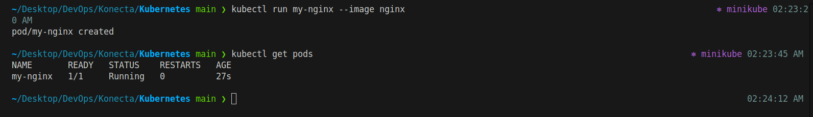

---

### 2. Create pod nginx with name my nginx command and use Image nginx123  direct from command don't use yaml file.

**Explanation:**
 - To create pod nginx without yaml file we use imperative way by use `kubectl run`. 
**Command:**
```bash
kubectl run my-nginx --image nginx123
kubectl get pods
```

**Verification Command:**  
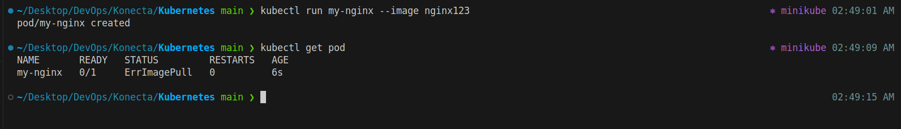

---

### 3.  Check the status and why it doesn't work.


**Explanation:**
 - The Pod is created but cannot run because the image nginx123 does not exist in Docker Hub (or your configured registry). Kubernetes will try to pull it, fail, and mark the Pod as ImagePullBackOff.
   
**Command:**
```bash
kubectl get pods
kubectl describe pod my-nginx
```
**Verification Command:**  
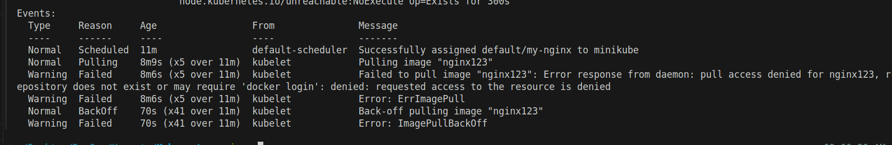


---

### 4. I need to know node name - IP - Image Of the POD.

**Explanation:**
  - we can use `kubectl get pod -o wide` to see the node name and Pod IP.
  - To check which image the pod using, we use `kubectl describe pod`.

**Command:**
```bash
kubectl get pod my-nginx -o wide
kubectl describe pod my-nginx | grep -i image
```
**Verification Command:**  
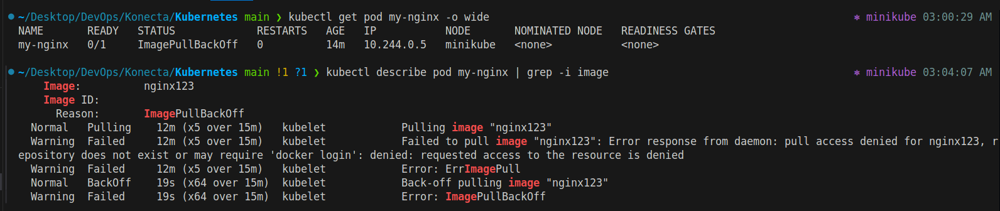

---

### 5.  Delete the pod. 

**Explanation:**
  - we can use `kubectl delete pod` for delete andy pod.

**Command:**
```bash
kubectl delete pod my-nginx
```

**Verification Command:**  
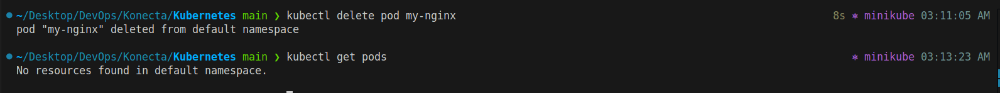

---

### 6. Create another one with yaml file and use label.

**Explanation:**
  - Now we will use Declarative way by apply the yaml file to create pod.

**Command:**
```bash
apiVersion: v1
kind: Pod
metadata:
  name: my-nginx
  labels:
    app: nginx
spec:
  containers:
  - name: nginx
    image: nginx
    ports:
    - containerPort: 80
```

**Command:**
```bash
kubectl apply -f pod-nginx.yaml
```

**Verification Command:**  
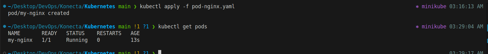

---

### 7. Create ReplicaSet with 3 replicas using nginx Image.

**Explanation:**
  - A ReplicaSet ensures a specific number of Pod replicas are always running. If a Pod fails or is deleted, the ReplicaSet creates a new one to maintain the count.


**Command:**
```bash
apiVersion: apps/v1
kind: ReplicaSet
metadata:
  name: frontend
  labels:
    app: nginx
spec:
  replicas: 3
  selector:
    matchLabels:
      tier: frontend
  template:
    metadata:
      labels:
        tier: frontend
    spec:
      containers:
      - name: nginx-container
        image: nginx
```

**Command:**
```bash
kubectl apply -f ReplicaSet.yaml
kubectl get replicasets
kubectl get pods
```

**Verification Command:**  
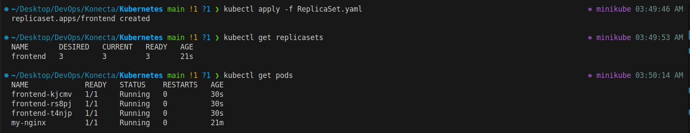

---

### 8. Scale the replicas to 5 without edit in the Yaml file.

**Explanation:**
  - we can scale up or down the nunber of replica by using `kubectl scale` .

**Command:**
```bash
kubectl scale replicaset --replicas=5 frontend
kubectl describe replicaset frontend | grep -i replica  # grep for number of replica
```

**Verification Command:**  
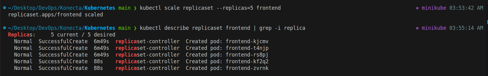

---

### 9. Delete any one of the 5 pods and check what happen and explain.

**Explanation:**
  - ReplicaSet ensures that the desired number of replicas is always running.

     - We scaled nginx-rs to 5 replicas.

     - If we manually delete one Pod, ReplicaSet detects that the number of running Pods dropped below 5.

     - It will automatically create a new Pod to replace the deleted one.
  
 - This is how Kubernetes maintains high availability and self-healing.

**Command:**
```bash
kubectl get pods -l tier=frontend  # To verifiy the pods in replica have the same label
kubectl delete pod frontend-kjcmv  # Delete one of the pod 
```

**Verification Command:**  
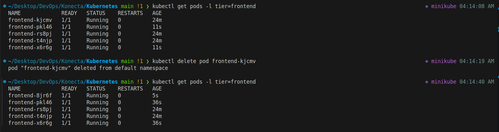


---

### 10. Scale down the pods aging to 2 without scale command use terminal.

**Explanation:**
  - We want to reduce the number of replicas from 5 to 2, but without kubectl scale.
  - The alternative way is to edit the ReplicaSet manifest directly from the terminal using `kubectl edit`.


**Command:**
```bash
kubectl edit replicaset frontend 
kubectl get pods  # To verifiy the number of pods
```

**Verification Command:**
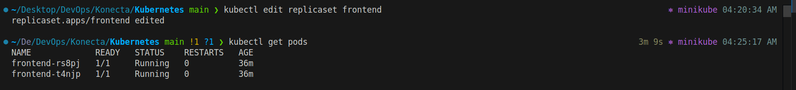
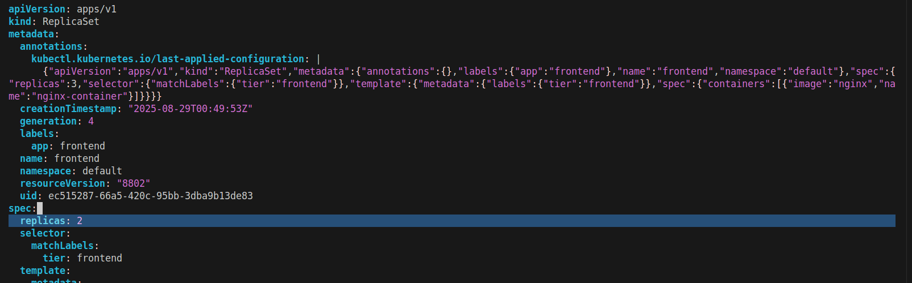

----

### 11. Find out the issue in the below Yaml.

```bash
apiVersion: apps/v1
kind: ReplicaSet
metadata:
  name: replicaset-2
spec:
  replicas: 2
  selector:
    matchLabels:
      tier: frontend
  template:
    metadata:
      labels:
        tier: nginx
    spec:
      containers:
      - name: nginx
        image: nginx
```
**Explanation of Issue:**
  - In ReplicaSet, the selctor matchLabels must match the label under template metadata.labels
   
    `Selector`:
    ```bash
    matchLabels:
      tier: frontend
    ```

    `Pod template labels`:
    ```bash
    labels:
      tier: nginx
    ```


### 12. Find out the issue in the below Yaml.

```bash
apiVersion: apps/v1
kind: deployment
metadata:
  name: deployment-1
spec:
  replicas: 2
  selector:
    matchLabels:
      name: busybox-pod
  template:
    metadata:
      labels:
        name: busybox-pod
    spec:
      containers:
      - name: busybox-container
        image: busybox
        command:
        - sh
        - "-c"
        - echo Hello Kubernetes! && sleep 3600
```

**Explanation of Issue:**
  - Issue → should be Deployment not deployment.
   
    `Kind`: Issuue
    ```bash
    kind: deployment
    ```

    `Kind`: Correct
    ```bash
    kind: Deployment
    ```

---


### 13. Find out the issue in the below Yaml.

```bash
apiVersion: v1
kind: Deployment
metadata:
  name: deployment-1
spec:
  replicas: 2
  selector:
    matchLabels:
      name: busybox-pod
  template:
    metadata:
      labels:
        name: busybox-pod
    spec:
      containers:
      - name: busybox-container
        image: busybox
        command:
        - sh
        - "-c"
        - echo Hello Kubernetes! && sleep 3600
```

**Explanation of Issue:**
  - Issue → In apiVersion should be apps/v1 not v1
   
    `Issue`:
    ```bash
    apiVersion: v1
    ```

    `Pod template labels`:
    ```bash
    apiVersion: apps/v1
    ```
--- 

### 14. What's command you use to know what Image name that running the deployment .

**Command:**
```bash
kubectl describe deployments < deployment-name > | grep -i image 
```

---

### 15. Create deployment using following data :
 - Name: httpd-frontend;
 - Replicas: 3;
 - Image: httpd:2.4-alpine

**Declarative**: Create yaml file
```bash
apiVersion: apps/v1
kind: Deployment
metadata:
  name: httpd-frontend
  labels:
    app: frontend
spec:
  replicas: 3
  selector:
    matchLabels:
      app: frontend
  template:
    metadata:
      labels:
        app: frontend
    spec:
      containers:
      - name: http-container
        image: httpd:2.4-alpine
```

**Command:**
```bash
kubectl apply -f deployment-http.yaml
kubectl get deploy
kubectl get pod 
```

**Verification Command:**
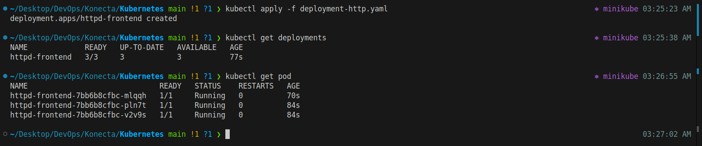

**Imperative**
```bash
kubectl create deployment deployment-http --image httpd:2.4-alpine --replicas 3
```

---

### 16. Replace the image to nginx777 with command directly.

**Command**
```bash
kubectl create deployment deployment-http --image httpd:2.4-alpine --replicas 3
```

**Verification Command:**
