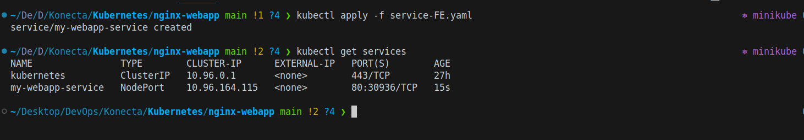
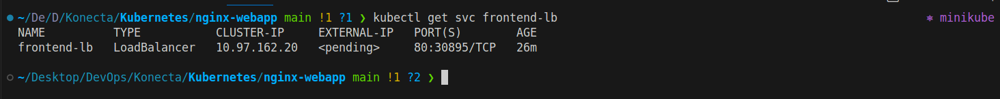

# kubernetes-practices

## Part1:

### 1. Create pod nginx with name my nginx direct from command don't use yaml file.

**Explanation:**
 - To create pod nginx without yaml file we use imperative way by use `kubectl run`. 
**Command:**
```bash
kubectl run my-nginx --image nginx
kubectl get pods
```
 - my-nginx: the pod name 
 - --image=nginx : tells Kubernetes to use the official nginx image

**Verification Command:**  


---

### 2. Create pod nginx with name my nginx command and use Image nginx123  direct from command don't use yaml file.

**Explanation:**
 - To create pod nginx without yaml file we use imperative way by use `kubectl run`. 
**Command:**
```bash
kubectl run my-nginx --image nginx123
kubectl get pods
```

**Verification Command:**  


---

### 3.  Check the status and why it doesn't work.


**Explanation:**
 - The Pod is created but cannot run because the image nginx123 does not exist in Docker Hub (or your configured registry). Kubernetes will try to pull it, fail, and mark the Pod as ImagePullBackOff.
   
**Command:**
```bash
kubectl get pods
kubectl describe pod my-nginx
```
**Verification Command:**  


---

### 4. I need to know node name - IP - Image Of the POD.

**Explanation:**
  - we can use `kubectl get pod -o wide` to see the node name and Pod IP.
  - To check which image the pod using, we use `kubectl describe pod`.

**Command:**
```bash
kubectl get pod my-nginx -o wide
kubectl describe pod my-nginx | grep -i image
```
**Verification Command:**  


---

### 5.  Delete the pod. 

**Explanation:**
  - we can use `kubectl delete pod` for delete andy pod.

**Command:**
```bash
kubectl delete pod my-nginx
```

**Verification Command:**  


---

### 6. Create another one with yaml file and use label.

**Explanation:**
  - Now we will use Declarative way by apply the yaml file to create pod.

**Command:**
```bash
apiVersion: v1
kind: Pod
metadata:
  name: my-nginx
  labels:
    app: nginx
spec:
  containers:
  - name: nginx
    image: nginx
    ports:
    - containerPort: 80
```

**Command:**
```bash
kubectl apply -f pod-nginx.yaml
```

**Verification Command:**  


---

### 7. Create ReplicaSet with 3 replicas using nginx Image.

**Explanation:**
  - A ReplicaSet ensures a specific number of Pod replicas are always running. If a Pod fails or is deleted, the ReplicaSet creates a new one to maintain the count.


**Command:**
```bash
apiVersion: apps/v1
kind: ReplicaSet
metadata:
  name: frontend
  labels:
    app: nginx
spec:
  replicas: 3
  selector:
    matchLabels:
      tier: frontend
  template:
    metadata:
      labels:
        tier: frontend
    spec:
      containers:
      - name: nginx-container
        image: nginx
```

**Command:**
```bash
kubectl apply -f ReplicaSet.yaml
kubectl get replicasets
kubectl get pods
```

**Verification Command:**  


---

### 8. Scale the replicas to 5 without edit in the Yaml file.

**Explanation:**
  - we can scale up or down the nunber of replica by using `kubectl scale` .

**Command:**
```bash
kubectl scale replicaset --replicas=5 frontend
kubectl describe replicaset frontend | grep -i replica  # grep for number of replica
```

**Verification Command:**  


---

### 9. Delete any one of the 5 pods and check what happen and explain.

**Explanation:**
  - ReplicaSet ensures that the desired number of replicas is always running.

     - We scaled nginx-rs to 5 replicas.

     - If we manually delete one Pod, ReplicaSet detects that the number of running Pods dropped below 5.

     - It will automatically create a new Pod to replace the deleted one.
  
 - This is how Kubernetes maintains high availability and self-healing.

**Command:**
```bash
kubectl get pods -l tier=frontend  # To verifiy the pods in replica have the same label
kubectl delete pod frontend-kjcmv  # Delete one of the pod 
```

**Verification Command:**  


---

### 10. Scale down the pods aging to 2 without scale command use terminal.

**Explanation:**
  - We want to reduce the number of replicas from 5 to 2, but without kubectl scale.
  - The alternative way is to edit the ReplicaSet manifest directly from the terminal using `kubectl edit`.


**Command:**
```bash
kubectl edit replicaset frontend 
kubectl get pods  # To verifiy the number of pods
```

**Verification Command:**


----

### 11. Find out the issue in the below Yaml.

```bash
apiVersion: apps/v1
kind: ReplicaSet
metadata:
  name: replicaset-2
spec:
  replicas: 2
  selector:
    matchLabels:
      tier: frontend
  template:
    metadata:
      labels:
        tier: nginx
    spec:
      containers:
      - name: nginx
        image: nginx
```
**Explanation of Issue:**
  - In ReplicaSet, the selctor matchLabels must match the label under template metadata.labels
   
    `Selector`:
    ```bash
    matchLabels:
      tier: frontend
    ```

    `Pod template labels`:
    ```bash
    labels:
      tier: nginx
    ```


### 12. Find out the issue in the below Yaml.

```bash
apiVersion: apps/v1
kind: deployment
metadata:
  name: deployment-1
spec:
  replicas: 2
  selector:
    matchLabels:
      name: busybox-pod
  template:
    metadata:
      labels:
        name: busybox-pod
    spec:
      containers:
      - name: busybox-container
        image: busybox
        command:
        - sh
        - "-c"
        - echo Hello Kubernetes! && sleep 3600
```

**Explanation of Issue:**
  - Issue → should be Deployment not deployment.
   
    `Kind`: Issuue
    ```bash
    kind: deployment
    ```

    `Kind`: Correct
    ```bash
    kind: Deployment
    ```

---


### 13. Find out the issue in the below Yaml.

```bash
apiVersion: v1
kind: Deployment
metadata:
  name: deployment-1
spec:
  replicas: 2
  selector:
    matchLabels:
      name: busybox-pod
  template:
    metadata:
      labels:
        name: busybox-pod
    spec:
      containers:
      - name: busybox-container
        image: busybox
        command:
        - sh
        - "-c"
        - echo Hello Kubernetes! && sleep 3600
```

**Explanation of Issue:**
  - Issue → In apiVersion should be apps/v1 not v1
   
    `Issue`:
    ```bash
    apiVersion: v1
    ```

    `Pod template labels`:
    ```bash
    apiVersion: apps/v1
    ```
--- 

### 14. What's command you use to know what Image name that running the deployment .

**Command:**
```bash
kubectl describe deployments < deployment-name > | grep -i image 
```

---

### 15. Create deployment using following data :
 - Name: httpd-frontend;
 - Replicas: 3;
 - Image: httpd:2.4-alpine

**Declarative**: Create yaml file
```bash
apiVersion: apps/v1
kind: Deployment
metadata:
  name: httpd-frontend
  labels:
    app: frontend
spec:
  replicas: 3
  selector:
    matchLabels:
      app: frontend
  template:
    metadata:
      labels:
        app: frontend
    spec:
      containers:
      - name: http-container
        image: httpd:2.4-alpine
```

**Command:**
```bash
kubectl apply -f deployment-http.yaml
kubectl get deploy
kubectl get pod 
```

**Verification Command:**


**Imperative**
```bash
kubectl create deployment deployment-http --image httpd:2.4-alpine --replicas 3
```


---

### 16. Replace the image to nginx777 with command directly.

**Command**
```bash
kubectl set image deployments httpd-frontend http-container=nginx777 
```

**Verification Command:**


---

### 17. Rollback to pervious version.

**Command**
```bash
kubectl rollout undo deployment httpd-frontend 
```

**Verification Command:**


---

### 18. Create a Simple Web Application:
* Use a Dockerfile to create a simple web application (e.g., an Nginx server serving an HTML page).
* Build the Docker image and push it to DockerHub your private Account.

**Create simple html page**
```bash
<!DOCTYPE html>
<html>
<head>
  <title>My WebApp</title>
</head>
<body>
  <h1>Hello from Abdelrahman’s Nginx WebApp !!</h1>
</body>
</html>
```

**Dockerfile**
```bash
FROM nginx:latest  

# Copy custom HTML into Nginx web root
COPY index.html /usr/share/nginx/html/

# Expose port 80
EXPOSE 80
```

**Build Image**
```bash
docker build -t my-nginx-webapp:1.0 . 
```

**Verification Command:**


**Login Dockerhub**
```bash
docker login 
```
**Verification Command:**


**Push Image in Dockerhub**
```bash
docker push abdelrahman404/my-nginx-webapp:1.0 
```
**Verification Command:**


---

### 19. 19- Create a Deployment Using This Image:
* Deploy the Docker image from DockerHub to Kubernetes with a Deployment that has 3 replicas.

```bash
apiVersion: apps/v1
kind: Deployment
metadata:
  name: my-nginx-webapp
  labels:
    app: frontend
spec:
  replicas: 3
  selector:
    matchLabels:
      app: frontend
  template:
    metadata:
      labels:
        app: frontend
    spec:
      containers:
      - name: nginx-container
        image: abdelrahman404/my-nginx-webapp:1.0
```

**Command**
```bash
kubectl apply -f frontend-deployment.yaml
kubectl get pods 
```

**Verification Command:**


---

### 20. Expose the Frontend (FE) Using Service to make it accessible from your browser.

```bash
apiVersion: v1
kind: Service
metadata:
  name: my-webapp-service
spec:
  selector:
    app: frontend
  ports:
    - protocol: TCP
      port: 80
      targetPort: 80
  type: NodePort
```

**Command**
```bash
kubectl apply -f service-FE.yaml
kubectl get services
```

**Verification Command:**



**Command**
```bash
kubectl describe nodes minikube | grep -i ip # to get node IP and access it in http://<NodeIP>:<NodePort>
```


**Verification Command:**


---

### 21. Create a Backend (BE) Deployment:
* Create another Deployment for the backend using the following data:
   - Image: python:3.8-slim
   - Command: ["python", "-m", "http.server", "8080"] (include this command in the deployment file).
  

```bash
apiVersion: apps/v1
kind: Deployment
metadata:
  name: backend-deployment
  labels:
    app: backend
spec:
  replicas: 3
  selector:
    matchLabels:
      app: backend
  template:
    metadata:
      labels:
        app: backend
    spec:
      containers:
      - name: backend-container
        image: python:3.8-slim
        command: ["python", "-m", "http.server", "8080"]
        ports:
        - containerPort: 8080
```

**Command**
```bash
kubectl apply -f backend-deployment.yaml
kubectl get deploy
```


**Verification Command:**


---

### 22. Expose the Backend Internally Using Service:
* Use kubectl command to make it accessible from your browser (without NodePort)


**Command**
```bash
kubectl expose deployment backend-deployment \
  --name=backend-service \
  --port 8080 \
  --target-port 8080 \
  --type ClusterIP
```

**Verification Command:**


**Command**
```bash
kubectl port-forward sevices/backend-service 8080:8080
```
**Verification Command:**


---

### 23. Create a LoadBalancer Service:
* Create a LoadBalancer service for your frontend.

```bash
apiVersion: v1
kind: Service
metadata:
  name: frontend-lb
spec:
  selector:
    app: frontend
  ports:
    - protocol: TCP 
     port: 80
     targetPort: 80
  type: LoadBalancer
```

**Verification Command:**


* Explain what happens when you try to apply it in an environment that does not support load balancers (e.g., Minikube).

- In Minikube or any local cluster (no cloud integration):

  - Kubernetes cannot provision a cloud load balancer, because there’s no cloud API.

  - The EXTERNAL-IP field in kubectl get svc will show <pending> forever.


**Verification Command:**


---

### 24. Explain DaemonSet and Provide a YAML File:

* Explain what a DaemonSet is and how it works.

  **DaemonSet**
    - A DaemonSet ensuers that a copy of Pod runs on all or some nodes in kubernets cluster
    - It's often used for cluster-wide services that need to run everywhere, such as:
      - Logging agents
      - Monitoring agents
      - Network components
      - Shared storage  
    
  **How DaemonSet work**
    - When you create a DaemonSet, kubernets schedules one Pod per node automatically
    - If a new node added to the cluster a new Pod created on that node.
    - If a node is removed also DaemonSet Pod removed
    - We can restrict DaemonSet to specific nodes using node selectors, tolerations, or node affinity.
    

* Provide a YAML file to create a DaemonSet in Kubernetes.

```bash
apiVersion: apps/v1
kind: DaemonSet
metadata:
  name: nginx-daemonset
  namespace: default
spec:
  selector:
    matchLabels:
      app: nginx-daemon
  template:
    metadata:
      labels:
        app: nginx-daemon
    spec:
      containers:
      - name: nginx
        image: nginx:1.25
        ports:
        - containerPort: 80
```
**Verification Command:**


---

### 25. List the Components of the **Master node** and what is the purpose of each component.

  **1. kube-apiserver**
  - **Purpose:** Acts as the **front door** of the Kubernetes cluster.  
  - **Responsibilities:**  
    - Exposes the Kubernetes REST API.  
    - Validates and processes API requests.  
    - Updates the etcd store with cluster state.  
    - Serves as the communication hub between components.  

  ---

  **2. etcd**
  - **Purpose:** A **distributed key-value store** that stores all cluster data.  
  - **Responsibilities:**  
    - Persists configuration data, secrets, and cluster state.  
    - Provides strong consistency guarantees.  
    - Functions as the **database of Kubernetes**.  

  ---
  **3. kube-scheduler**
  - **Purpose:** Determines **which node** a Pod should run on.  
  - **Responsibilities:**  
    - Considers resource availability (CPU, memory).  
    - Evaluates affinity/anti-affinity rules.  
    - Checks taints/tolerations.  
    - Assigns Pods, but does not run them itself.  


  ---
  **4. kube-controller-manager**
  - **Purpose:** Runs background **controllers** that manage cluster state.  
  - **Key Controllers:**  
    - **Node Controller:** Monitors node health.  
    - **Replication Controller:** Ensures desired number of Pods are running.  
    - **Endpoint Controller:** Updates Services and Pod endpoints.  
    - **Service Account & Token Controllers:** Handle Pod authentication.  
  ---
  **5. cloud-controller-manager (Cloud Environments Only)**
  - **Purpose:** Integrates Kubernetes with cloud providers (AWS, GCP, Azure, etc.).  
  - **Responsibilities:**  
    - Manages cloud-specific features:  
      - Node lifecycle.  
      - Route management.  
      - Load balancer provisioning.  
      - Persistent volume integration.  

---

### 26.  List  the Components of the **Worker node** and what is the purpose of each component.


**1. kubelet**
- **Purpose:** The **agent** that runs on each worker node.  
- **Responsibilities:**  
  - Registers the node with the Kubernetes cluster.  
  - Ensures containers described in PodSpecs are running.  
  - Monitors Pod health and reports back to the API server.  
  - Manages Pod lifecycle (start, stop, restart).  

---

**2. kube-proxy**
- **Purpose:** Maintains **networking rules** on worker nodes.  
- **Responsibilities:**  
  - Implements **Service networking** (ClusterIP, NodePort, LoadBalancer).  
  - Routes traffic to the correct Pod across nodes.  
  - Uses iptables or IPVS to handle load balancing.  

---

**3. Container Runtime**
- **Purpose:** The software that actually **runs containers**.  
- **Examples:** Docker, containerd, CRI-O.  
- **Responsibilities:**  
  - Pulls container images from registries.  
  - Starts and stops containers.  
  - Provides the container environment to run applications. 

---

## Part2

### 1. Namespace

*In kubernetes, namespaces provide a mechanism for isolating groups of resources within a single cluster. Names of resources need to be unique within a namespaces, but not across namespaces. Namespace-based scoping applicable only for namespaced objects (e.g. Deployment, Service, etc) and not for cluster-wide objects (e.g. StorageClass, Nodes, PersistentVolumes, etc.).*

- **Default namespaces:**  
  - `default` → where resources are created if no namespace is specified.  
  - `kube-system` → system components.  
  - `kube-public` → public resources, accessible by all users.  
- **Command examples:**  
  ```bash
  kubectl get namespaces
  kubectl create namespace dev
  kubectl get pods -n kube-system
  ```
### 2. Configmap

*A ConfigMaps is an API object used to store non-confidential data in key-value pairs, Pods  can consume ConfigMaps as environment variables, command-line arguments, or as configuration files in volume.*

*A ConfigMaps allows you to decouple environment-specific configuration from your container images, so that your application are easily portable.*

- Use Cases: Environment variables, command-line arguments, config files.

- **Command examples:**  
  ```bash
  kubectl create configmap app-config --from-literal=ENV=prod
  kubectl get configmap app-config -o yaml
  ```

### 3. Secret

*A Secret is an object that cotains a small amount of sensitive data such as password, a token, or a key. Such information might otherwise be put in a pod specification or in a container image. Using a Secret means that you do not need to include confidential data in your application code.*

- Purpose: Keeps secrets encrypted in etcd and mounted securely.

- **Command examples:**  
  ```bash
  kubectl create secret generic db-secret --from-literal=DB_PASS=12345
  kubectl get secret db-secret -o yaml
  ```

### 4. Network Policy

*If you want to cotrol traffic flow at the IP address or port level (OSI layer 3 or 4), NetworkPolicies allow you to specify rules for traffic flow within your cluster, and also between Pods and the outside world. your cluster must use a network plugin that supports NetworkPolicy enforcement.*

- Key points:

  - By default, Pods can talk to each other freely.

  - Network Policies are deny-all by default once applied.

- **Command examples:**  
  ```bash
  kubectl apply -f network-policy.yaml
  ```

### 5. Taint and toleration

*Taints are the opposite, they allow a node to repel a set of pods.*

*Tolerations are applied to pods, Tolerations allow the scheduler to schedule pods with matching taints. Tolerations allow scheduling but do not guarantee scheduling.*

*Taints and tolerations work together to ensure that pods are not scheduled onto inappropriate nodes. One or more taints are applied to a node, this marks that the node should not accept any pods that do not tolerate the taints.*

- **Command examples:**  
  ```bash 
  # Add a taint to a node
  kubectl taint nodes node1 key=value:NoSchedule

  # Remove the taint
  kubectl taint nodes node1 key=value:NoSchedule-
  ```

### 6. Volume

*Kubernetes volumes provide a way for containers in a pod to access and share data via the filesystem. There are different kinds of volume that you can use for different purposes, such as:*

 - populating a configuration file based on a ConfigMap or a Secret
 - providing some temporary scratch space for a pod
 - sharing a filesystem between two different containers in the same pod
 - sharing a filesystem between two different pods (even if those Pods run on different nodes)
 - durably storing data so that it stays available even if the Pod restarts or is replaced
 - passing configuration information to an app running in a container, based on details of the Pod the container is in (for example: telling a sidecar container what namespace the Pod is running in)
 - providing read-only access to data in a different container image

*Data sharing can be between different local processes within a container, or between different containers, or between Pods.*

Types of volumes:

 - emptyDir → temporary storage, deleted when Pod stops.

 - hostPath → uses node’s filesystem.

 - persistentVolume (PV) + persistentVolumeClaim (PVC) → dynamic storage.

---
## Part3:

### 1. Start minikube with 2 nodes 

```bash
minikube start --nodes=2 -p multinode
kubectl get nodes
```
**Verification Command:**


### 2. create 3 namespaces (FE, mongo-db, mongo-express).

```bash
kubectl create namespace fe
kubectl create namespace mongo-db
kubectl create namespace mongo-express
kubectl get namespace
```
**Verification Command:**


**Or Apply it in yaml file**

```bash
apiVersion: v1
kind: Namespace
metadata:
  name: fe
---
apiVersion: v1
kind: Namespace
metadata:
  name: mongo-db
---
apiVersion: v1
kind: Namespace
metadata:
  name: mongo-express

```